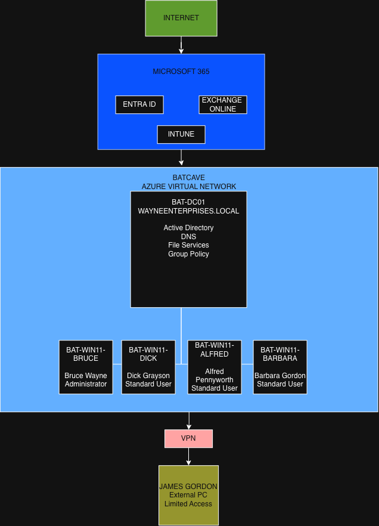

# Wayne Enterprises IT Lab

## Enterprise Endpoint & Identity Lab

A hands-on enterprise IT lab built with Microsoft Azure and Microsoft 365 to practice identity management, endpoint management, infrastructure, networking, security, and troubleshooting.

The environment is designed as a fictional Wayne Enterprises organization and uses a Batman-inspired naming convention to make the project engaging while demonstrating real-world enterprise IT concepts.

---

## Project Objectives

This project is designed to provide practical experience with:

* Microsoft Azure
* Microsoft Entra ID
* Microsoft Intune
* Microsoft 365
* Exchange Online
* Active Directory Domain Services
* DNS
* Group Policy
* Windows 11 deployment
* Windows endpoint management
* File and folder permissions
* PowerShell
* VPN and remote access
* Microsoft security controls
* Troubleshooting and incident response

---

## Environment

### Users

| User              | Role                      | Access Level               |
| ----------------- | ------------------------- | -------------------------- |
| Bruce Wayne       | Executive / Administrator | Full Administrative Access |
| Dick Grayson      | Standard Employee         | Standard User              |
| Alfred Pennyworth | Executive Support         | Standard User              |
| Barbara Gordon    | Security / Technical User | Standard User              |
| James Gordon      | External / Remote User    | Limited Access             |

The environment follows a least-privilege approach. Administrative access is intentionally restricted, while James Gordon represents an external user with limited access to internal resources.

---

## Planned Infrastructure

### Azure

* Azure Resource Group
* Azure Virtual Network
* Windows Server
* Windows 11 Workstations
* Network security configuration
* Cost-control measures

### Identity

* Microsoft Entra ID
* Active Directory
* Security Groups
* Organizational Units
* Group Policy
* Role-based access
* Least-privilege administration

### Endpoint Management

* Windows 11
* Microsoft Intune
* Device enrollment
* Configuration policies
* Application deployment
* Compliance policies
* Windows security configuration

### Microsoft 365

* Microsoft 365 user accounts
* Exchange Online
* Outlook
* User licensing
* Cloud identity integration

### Networking

* Azure Virtual Network
* DNS
* Internal network communication
* VPN
* Remote access
* Network troubleshooting

---

## Planned Workstations

| User              | Workstation         |
| ----------------- | ------------------- |
| Bruce Wayne       | `BAT-WIN11-BRUCE`   |
| Dick Grayson      | `BAT-WIN11-DICK`    |
| Alfred Pennyworth | `BAT-WIN11-ALFRED`  |
| Barbara Gordon    | `BAT-WIN11-BARBARA` |

James Gordon will initially use an external workstation rather than a dedicated Azure virtual machine. His environment will be used to demonstrate remote access, VPN connectivity, authentication, and least-privilege access.

---

## Planned Server

### `BAT-DC01`

The initial Windows Server will combine several roles to keep the lab cost-effective:

* Active Directory Domain Services
* Domain Controller
* DNS
* File Services
* Group Policy

### Active Directory Domain

`WAYNEENTERPRISES.LOCAL`

---

## Architecture

The lab will eventually include:

```

```

The architecture diagrams will be expanded and updated as the environment is built.

---

## Project Phases

1. Azure and project foundation
2. Microsoft Entra ID
3. Microsoft 365 and Exchange Online
4. Azure infrastructure
5. Active Directory and DNS
6. File services and permissions
7. Windows workstation deployment
8. Microsoft Intune
9. Applications and compliance
10. Security controls
11. VPN and remote access
12. Troubleshooting scenarios
13. Portfolio documentation

---

## Troubleshooting

The lab will include intentionally created troubleshooting scenarios to practice enterprise IT support.

Examples include:

* DNS failures
* Domain authentication failures
* File-share permission issues
* Intune enrollment problems
* Application deployment failures
* Windows Update issues
* VPN connectivity problems
* Network connectivity problems
* User access issues

Each scenario will document:

1. Symptoms
2. Investigation
3. Root cause
4. Resolution
5. Validation
6. Lessons learned

---

## Documentation

Project documentation will include:

* Architecture diagrams
* Network diagrams
* Configuration documentation
* Screenshots
* PowerShell scripts
* Troubleshooting scenarios
* IT support tickets
* Lessons learned

Sensitive information such as passwords, authentication secrets, private keys, API keys, and other credentials will never be committed to the repository.

---

## Project Status

🟡 **In Progress**

Current phase:

**Phase 0 — Project Foundation**

---

## Disclaimer

Wayne Enterprises and the associated characters are used as fictional themes for this educational lab. The technical configurations and procedures are intended to demonstrate enterprise IT concepts and are not affiliated with DC Comics or Warner Bros.
